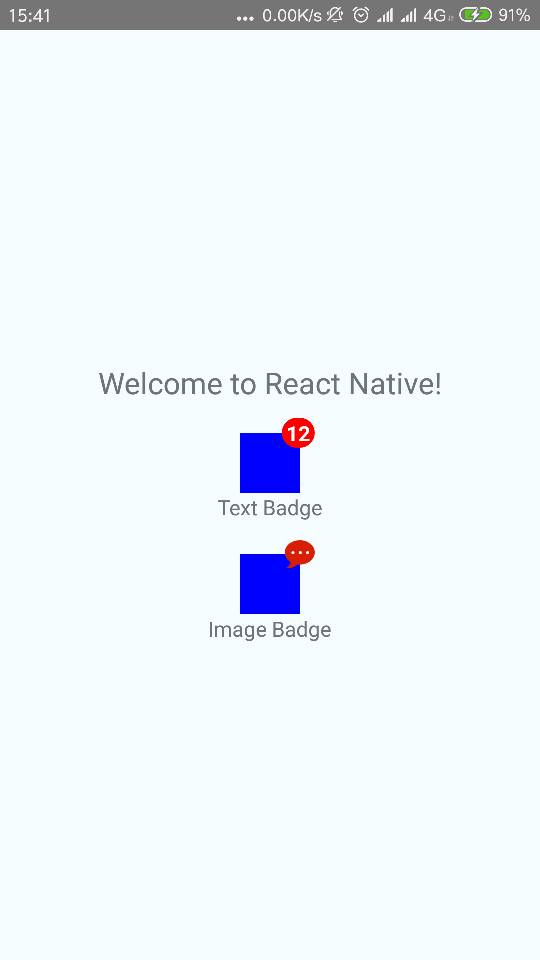

RNBadgeView
===========================


Installation
----------
>
`npm i react-native-badge-view -S`

Base Use
-------
>
```
<BadgeView parentView={<View style={{width: 40, height: 40, backgroundColor: 'blue'}}/>} 
           badgeText={"12"}/>
```

```
<BadgeView parentView={<View style={{width: 40, height: 40, backgroundColor: 'blue'}}/>
                } badgeImageSource={require('./badge-view/test.png')}/>
```

Prop
----
>
|Prop|Type|Required|Default|Comment|
|:----:|:---:|:---:|:---:|:----:|
|badgePosition|string|optional|right|The position of badge, one of *right* or *left*|
|badgeText|string|optional|--|The text of badge, if the text is an empty string or equal to *0*, the badge will be invisible.|
|badgeImageSource|{uri:string},number|optional|--|The image source of badge.It works only the `badgeText` is *empty*.|
|badgeImageWidth|number|optional|20|The width of badge image. It works only the `badgeImageSource` is *not* empty.|
|badgeImageHeight|number|optional|20|The height of badge image. It works only the `badgeImageSource` is *not* empty.|
|badgeTextColor|string|optional|white|The text color of badge, default is *white*.|
|autoSize|bool|optional|true|When the prop is *true*, the badge size will be self-adaption to the text size.|
|badgeSize|number|optional|20|The size of badge,default is *20*. It works only when the `autoSize` is *false*.|
|badgeBackgroundColor|string|optional|red|The background color of badge, default is *red*.|
|parentView|element|required|--|The parent view of badge, it is required.|

ScreenShot
---------
>

